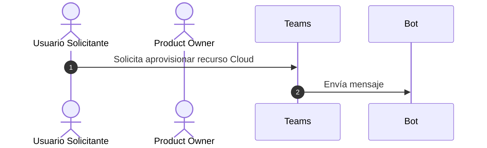

# diagram

```mermaid
sequenceDiagram
    autonumber
    actor Dev as Usuario Solicitante
    actor PO as Product Owner
    
    Dev->>Teams: Solicita aprovisionar recurso Cloud
    Teams->>Bot: Envía mensaje
    %% ... aquí va el resto del código ...
```
