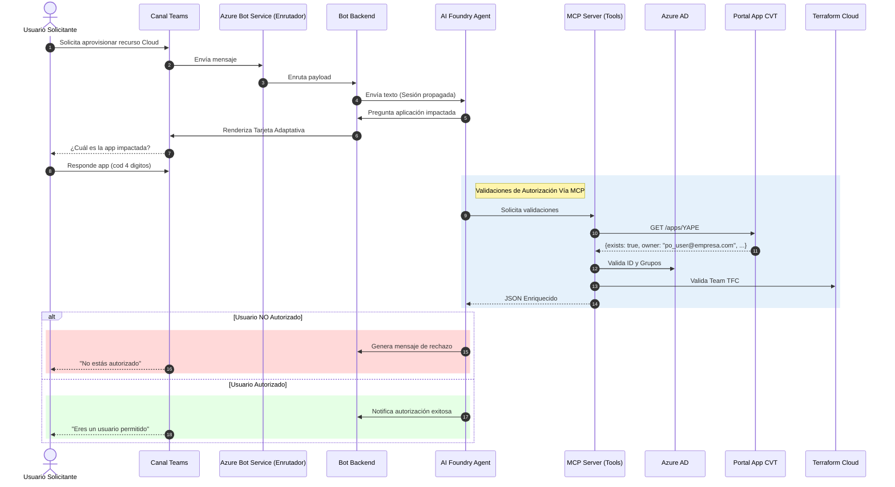
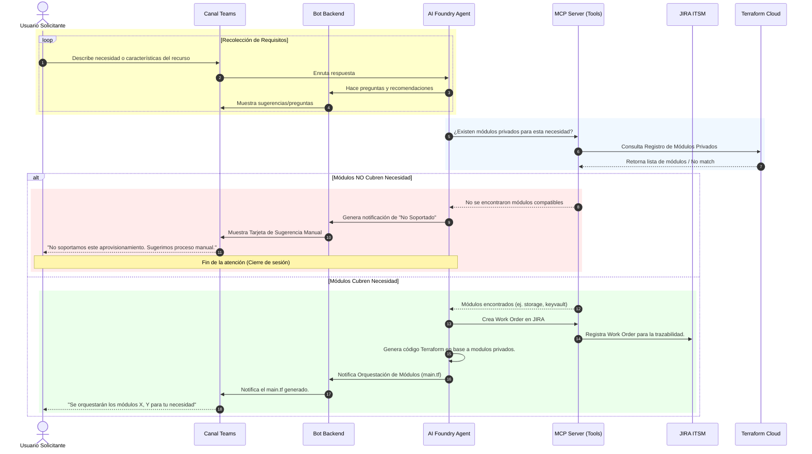
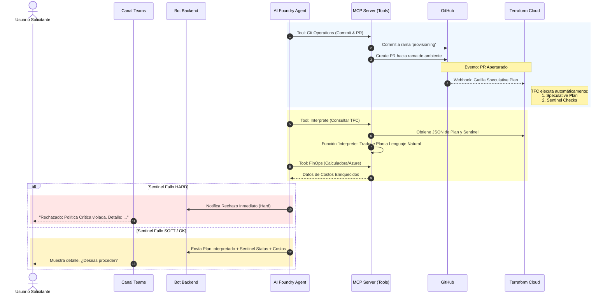
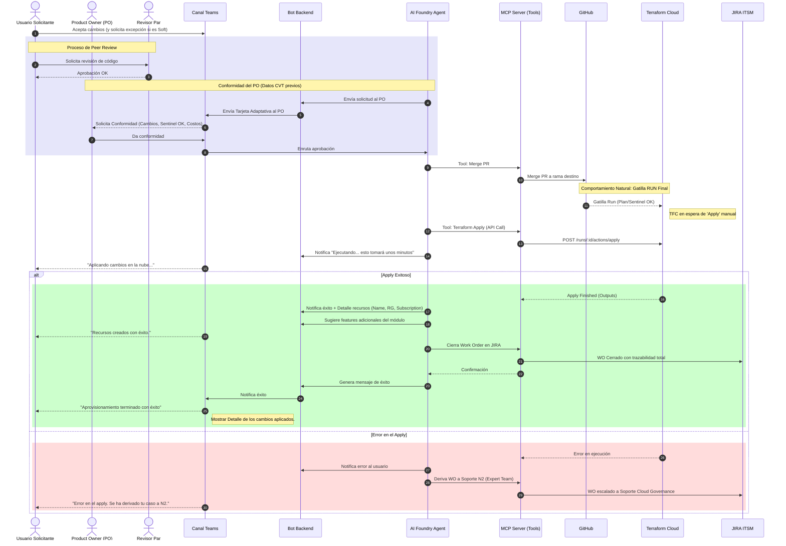

# diagram

<b>Fase 1: Validación de Identidad y Autorización</b>

<b>Fase 2: Diseño y Validación de Módulos</b>

    

<b>Fase 3: GitOps, Sentinel y FinOps</b>

<b>Fase 4: Gobernanza y Aprovisionamiento Final</b>

