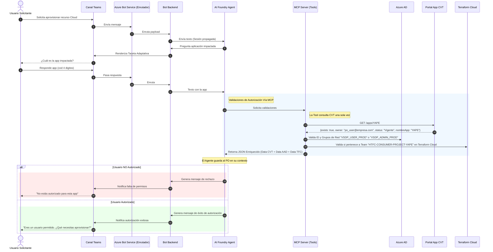

# diagram

```mermaid

sequenceDiagram
    autonumber
    
    actor Dev as Usuario Solicitante 
    participant Teams as Canal Teams
    participant Bot as Azure Bot Service (Enrutador)
    participant Backend as Bot Backend
    participant Agent as AI Foundry Agent
    participant MCP as MCP Server (Tools)
    participant AAD as Azure AD
    participant CVT as Portal App CVT
    participant TFC as Terraform Cloud

    Dev->>Teams: Solicita aprovisionar recurso Cloud
    Teams->>Bot: Envía mensaje
    Bot->>Backend: Enruta payload
    Backend->>Agent: Envía texto (Sesión propagada)
    Agent->>Backend: Pregunta aplicación impactada
    Backend->>Teams: Renderiza Tarjeta Adaptativa
    Teams-->>Dev: ¿Cuál es la app impactada?
    Dev->>Teams: Responde app (cod 4 digitos)
    Teams->>Bot: Pasa respuesta
    Bot->>Backend: Enruta
    Backend->>Agent: Texto con la app
    
    rect rgb(240, 248, 255)
        Note right of Agent: Validaciones de Autorización Vía MCP
        Agent->>MCP: Solicita validaciones
        Note right of MCP: La Tool consulta CVT una sola vez
        MCP->>CVT: GET /apps/YAPE
        CVT-->>MCP: {exists: true, owner: "po_user@empresa.com", status: "Vigente", nombreApp: "YAPE"}
        MCP->>AAD: Valida ID y Grupos de Red "VSDP_USER_PROD" o "VSDP_ADMIN_PROD"
        MCP->>TFC: Valida si pertenece a Team "HTFC-CONSUMER-PROJECT-YAPE" en Terraform Cloud
        MCP-->>Agent: Retorna JSON Enriquecido (Data CVT + Data AAD + Data TFC)
    end
    
    Note over Agent: El Agente guarda al PO en su contexto

    alt Usuario NO Autorizado
        rect rgb(255, 235, 235)
            Agent->>Backend: Genera mensaje de rechazo
            Backend->>Teams: Notifica falta de permisos
            Teams-->>Dev: "No estás autorizado para esta app"
        end
    else Usuario Autorizado
        rect rgb(235, 255, 235)
            Agent->>Backend: Genera mensaje de éxito de autorización
            Backend->>Teams: Notifica autorización exitosa
            Teams-->>Dev: "Eres un usuario permitido. ¿Qué necesitas aprovisionar?"
        end
    end
```
