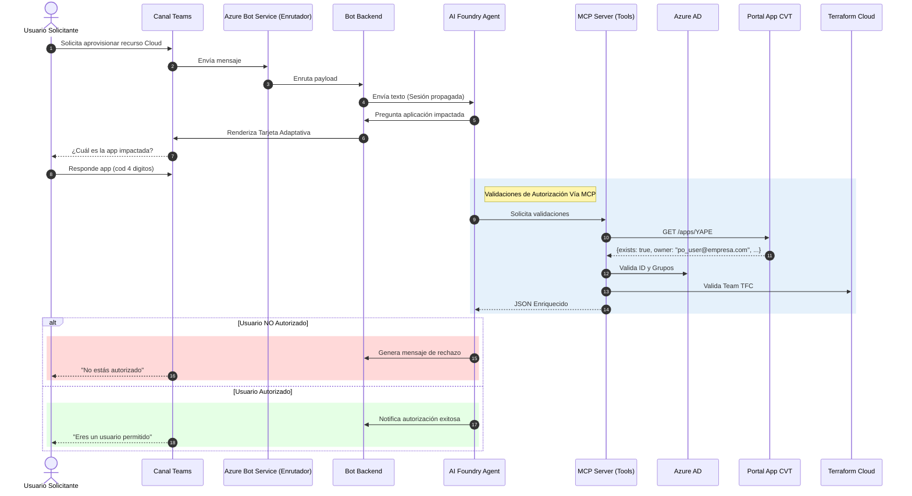

# diagram

<b>Fase 1: Validación de Identidad y Autorización</b>

```mermaid

sequenceDiagram
    autonumber
    
    actor Dev as Usuario Solicitante 
    participant Teams as Canal Teams
    participant Bot as Azure Bot Service (Enrutador)
    participant Backend as Bot Backend
    participant Agent as AI Foundry Agent
    participant MCP as MCP Server (Tools)
    participant AAD as Azure AD
    participant CVT as Portal App CVT
    participant TFC as Terraform Cloud

    Dev->>Teams: Solicita aprovisionar recurso Cloud
    Teams->>Bot: Envía mensaje
    Bot->>Backend: Enruta payload
    Backend->>Agent: Envía texto (Sesión propagada)
    Agent->>Backend: Pregunta aplicación impactada
    Backend->>Teams: Renderiza Tarjeta Adaptativa
    Teams-->>Dev: ¿Cuál es la app impactada?
    Dev->>Teams: Responde app (cod 4 digitos)
    
    rect rgba(0, 120, 215, 0.1)
        Note right of Agent: Validaciones de Autorización Vía MCP
        Agent->>MCP: Solicita validaciones
        MCP->>CVT: GET /apps/YAPE
        CVT-->>MCP: {exists: true, owner: "po_user@empresa.com", ...}
        MCP->>AAD: Valida ID y Grupos
        MCP->>TFC: Valida Team TFC
        MCP-->>Agent: JSON Enriquecido
    end
    
    alt Usuario NO Autorizado
        rect rgba(255, 0, 0, 0.15)
            Agent->>Backend: Genera mensaje de rechazo
            Teams-->>Dev: "No estás autorizado"
        end
    else Usuario Autorizado
        rect rgba(0, 255, 0, 0.1)
            Agent->>Backend: Notifica autorización exitosa
            Teams-->>Dev: "Eres un usuario permitido"
        end
    end

```

<b>Fase 2: Diseño y Validación de Módulos</b>

