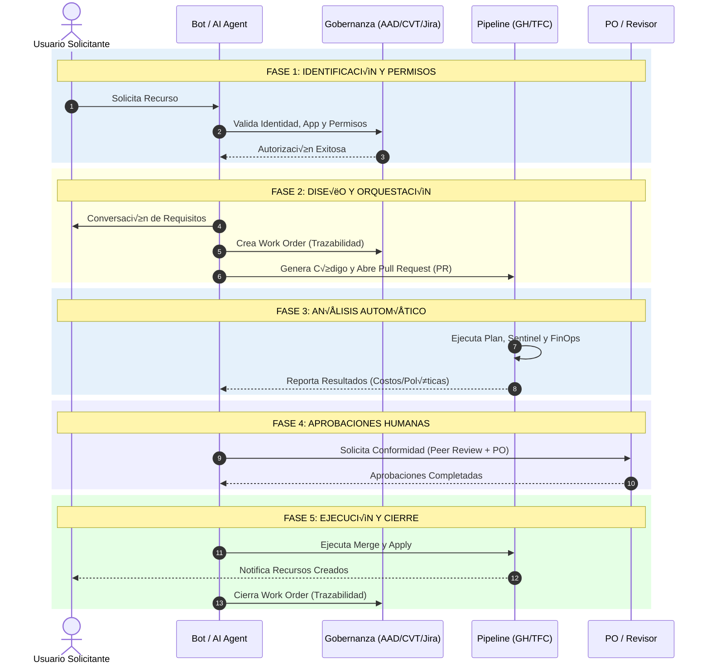
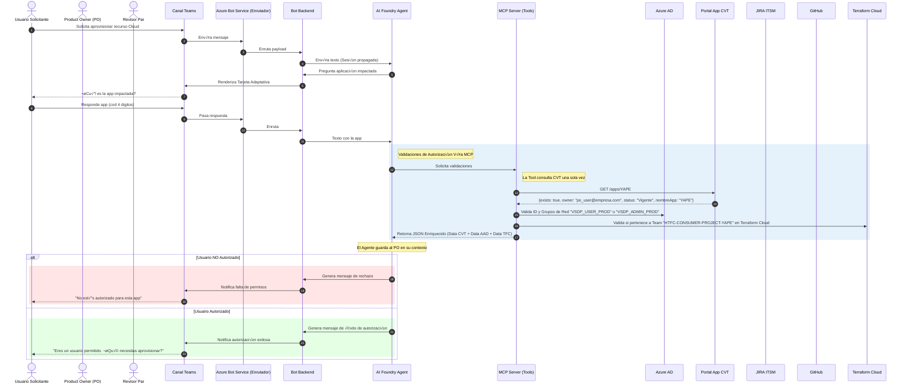
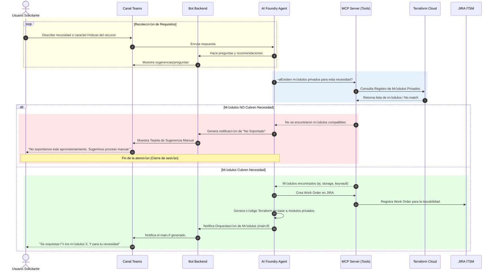
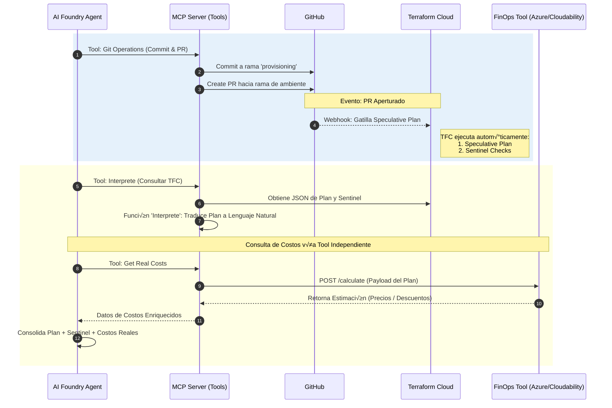
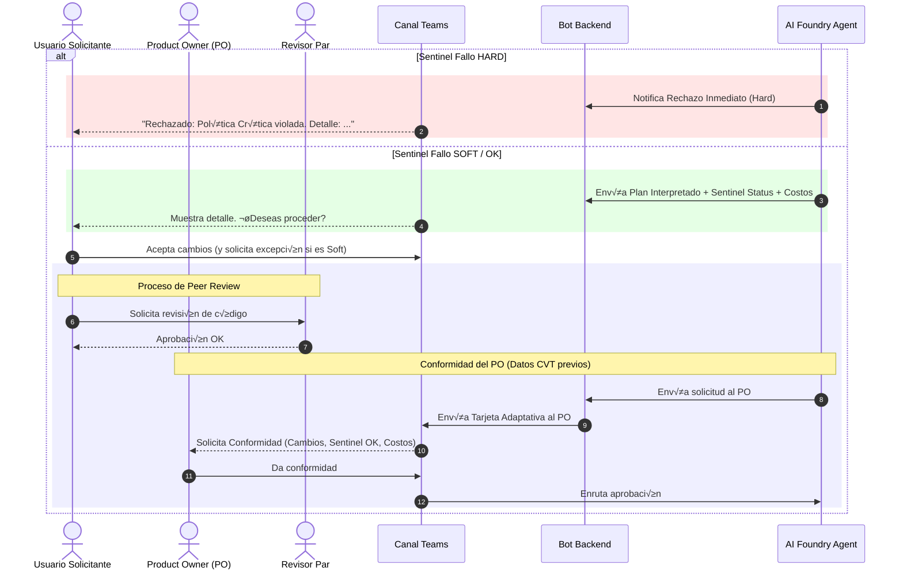
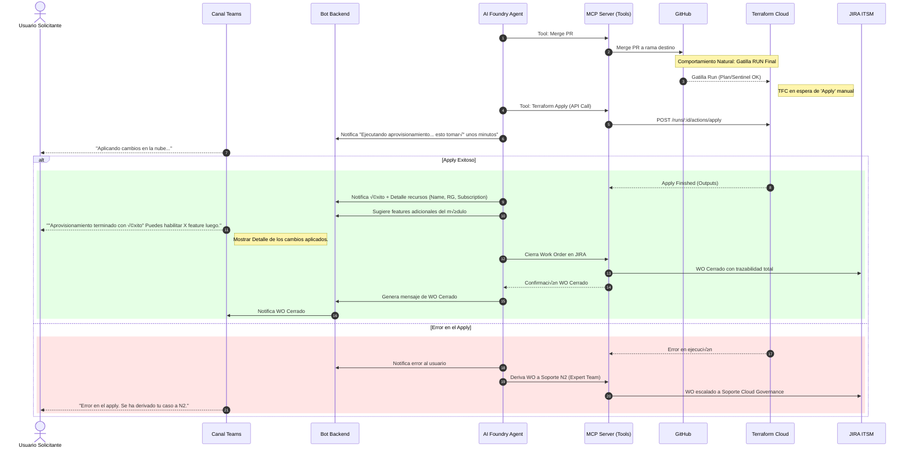

# 🤖 AI Infrastructure Provisioning Agent
## CloudOpsAI
> **Orquestación inteligente de infraestructura como código (IaC) mediante GitOps y Gobernanza automatizada.**

Este documento detalla el ciclo de vida de una solicitud de aprovisionamiento, desde la intención del usuario en el chat hasta el despliegue final en la nube. El sistema integra **AI Foundry Agents**, **MCP Servers (Model Context Protocol)** y **Terraform Cloud**.

---

## üìç Flujo Maestro (Nivel 0)
Este diagrama representa la "Hoja de Ruta" del proceso. Proporciona una visión macro de las 5 fases principales del servicio.

```mermaid
sequenceDiagram
    autonumber
    
    %% Configuración de colores agnósticos al tema
    actor Dev as Usuario Solicitante
    participant Bot as Bot / AI Agent
    participant Gov as Gobernanza (AAD/CVT/Jira)
    participant GitOps as Pipeline (GH/TFC)
    participant Aprobador as PO / Revisor

    rect rgba(0, 120, 215, 0.1)
        Note over Dev, Aprobador: FASE 1: IDENTIFICACIÓN Y PERMISOS
        Dev->>Bot: Solicita Recurso
        Bot->>Gov: Valida Identidad, App y Permisos
        Gov-->>Bot: Autorización Exitosa
    end

    rect rgba(255, 255, 0, 0.1)
        Note over Dev, Aprobador: FASE 2: DISEÑO Y ORQUESTACIÓN
        Bot->>Dev: Conversación de Requisitos
        Bot->>Gov: Crea Work Order (Trazabilidad)
        Bot->>GitOps: Genera Código y Abre Pull Request (PR)
    end

    rect rgba(0, 120, 215, 0.1)
        Note over Dev, Aprobador: FASE 3: ANÁLISIS AUTOMÁTICO
        GitOps->>GitOps: Ejecuta Plan, Sentinel y FinOps
        GitOps-->>Bot: Reporta Resultados (Costos/Políticas)
    end

    rect rgba(100, 100, 255, 0.1)
        Note over Dev, Aprobador: FASE 4: APROBACIONES HUMANAS
        Bot->>Aprobador: Solicita Conformidad (Peer Review + PO)
        Aprobador-->>Bot: Aprobaciones Completadas
    end

    rect rgba(0, 255, 0, 0.1)
        Note over Dev, Aprobador: FASE 5: EJECUCIÓN Y CIERRE
        Bot->>GitOps: Ejecuta Merge y Apply
        GitOps-->>Dev: Notifica Recursos Creados
        Bot->>Gov: Cierra Work Order (Trazabilidad)
    end
```
## üìç Responsabilidades

| Fase | Responsable Principal | Descripción Key |
| :--- | :--- | :--- |
| **1. Identificación** | AI Agent + AAD/CVT | Validación de que el usuario tiene permisos sobre la App impactada. |
| **2. Diseño** | AI Agent + TFC Registry | Selección de módulos privados y generación de código HCL. |
| **3. Análisis** | Terraform Cloud | Ejecución de Speculative Plans, validación de políticas y estimación de costos. |
| **4. Gobernanza** | PO + Revisor Par | Validación humana del impacto técnico y financiero antes del despliegue. |
| **5. Ejecución** | AI Agent + MCP Tool | Aplicación de cambios (`apply`) y cierre de tickets en Jira. |

---

## üë• Diagrama de Caso de Uso
El siguiente diagrama describe las interacciones entre los actores (Usuario, PO, Revisor) y las funcionalidades principales del sistema orquestado por IA.

> [!NOTE]
> Para editar este diagrama, abre el archivo `.drawio` adjunto en la carpeta de recursos utilizando [app.diagrams.net](https://app.diagrams.net/).

---
## 🛠️ Herramientas y Componentes Relacionados

El ecosistema se divide entre servicios de plataforma y los componentes core desarrollados para la orquestación:

| Herramienta / Componente | Capacidad | Propósito en el Flujo |
| :--- | :--- | :--- |
| **Microsoft Teams** | Interfaz de Usuario | Punto de contacto inicial; renderiza Tarjetas Adaptativas para la interacción con el usuario. |
| **Azure Bot Service** | Enrutador de Mensajes | Act√∫a como el "Gateway" que recibe los eventos de Teams y los canaliza hacia el Backend. |
| **Bot Backend** | Orquestador de Lógica | Componente central que gestiona el estado de la sesión, propaga el contexto y conecta con la IA. |
| **AI Foundry Agent** | Motor Cognitivo | Agente de IA que interpreta la intención del usuario y decide qué herramientas (Tools) ejecutar. |
| **MCP Server** | Host de Herramientas | Servidor basado en el *Model Context Protocol* que expone las capacidades técnicas al Agente. |
| **MCP Tools** | Conectores Específicos | Funciones personalizadas para ejecutar acciones en CVT, JIRA, AAD, GitHub y Terraform Cloud. |
| **Terraform Cloud** | Engine de Infraestructura | Registro de módulos privados, ejecución de planes, Sentinel (Governance) y FinOps. |
| **GitHub** | Repositorio GitOps | Almacena el código generado y gestiona el ciclo de vida de los cambios mediante Pull Requests. |
| **Jira / AAD / CVT** | Sistemas de Registro | Fuentes de verdad para trazabilidad (Jira), Identidad (AAD) e inventario de Apps (CVT). |
| **FinOps Tool (Azure/Cloudability)** | Calculadora de Costos | Herramienta externa que calcula el impacto financiero real basado en el Plan de Terraform, aplicando precios específicos del contrato  y descuentos. |

---

## 🔍 Detalle Técnico de Interacciones (Diagramas de Secuencia)
Selecciona una fase para ver el diagrama de secuencia detallado con todas las llamadas a herramientas  y validaciones específicas:

<b>Fase 1: Validación de Identidad y Autorización</b>

```mermaid

sequenceDiagram
    autonumber
    
    actor Dev as Usuario Solicitante 
    actor PO as Product Owner (PO)
    actor Revisor as Revisor Par 
    participant Teams as Canal Teams
    participant Bot as Azure Bot Service (Enrutador)
    participant Backend as Bot Backend
    participant Agent as AI Foundry Agent
    participant MCP as MCP Server (Tools)
    participant AAD as Azure AD
    participant CVT as Portal App CVT
    participant Jira as JIRA ITSM
    participant GH as GitHub
    participant TFC as Terraform Cloud

    %% Fase 1: Intención y Validación de Identidad Extensiva
    Dev->>Teams: Solicita aprovisionar recurso Cloud
    Teams->>Bot: Envía mensaje
    Bot->>Backend: Enruta payload
    Backend->>Agent: Envía texto (Sesión propagada)
    Agent->>Backend: Pregunta aplicación impactada
    Backend->>Teams: Renderiza Tarjeta Adaptativa
    Teams-->>Dev: ¬øCu√°l es la app impactada?
    Dev->>Teams: Responde app (cod 4 digitos)
    Teams->>Bot: Pasa respuesta
    Bot->>Backend: Enruta
    Backend->>Agent: Texto con la app
    
    rect rgba(0, 120, 215, 0.1)
        Note right of Agent: Validaciones de Autorización Vía MCP
        Agent->>MCP: Solicita validaciones
        Note right of MCP: La Tool consulta CVT una sola vez
        MCP->>CVT: GET /apps/YAPE
        CVT-->>MCP: {exists: true, owner: "po_user@empresa.com", status: "Vigente", nombreApp: "YAPE"}
        MCP->>AAD: Valida ID y Grupos de Red "VSDP_USER_PROD" o "VSDP_ADMIN_PROD"
        MCP->>TFC: Valida si pertenece a Team "HTFC-CONSUMER-PROJECT-YAPE" en Terraform Cloud
        MCP-->>Agent: Retorna JSON Enriquecido (Data CVT + Data AAD + Data TFC)
    end
    
    Note over Agent: El Agente guarda al PO en su contexto

    alt Usuario NO Autorizado
        rect rgba(255, 0, 0, 0.1)
            Agent->>Backend: Genera mensaje de rechazo
            Backend->>Teams: Notifica falta de permisos
            Teams-->>Dev: "No est√°s autorizado para esta app"
        end
    else Usuario Autorizado
        rect rgba(0, 255, 0, 0.1)
            Agent->>Backend: Genera mensaje de éxito de autorización
            Backend->>Teams: Notifica autorización exitosa
            Teams-->>Dev: "Eres un usuario permitido. ¿Qué necesitas aprovisionar?"
        end
    end
```

<b>Fase 2: Entendimiento y Validación de Módulos</b>

    

```mermaid
sequenceDiagram
    autonumber
    
    actor Dev as Usuario Solicitante 
    participant Teams as Canal Teams
    participant Backend as Bot Backend
    participant Agent as AI Foundry Agent
    participant MCP as MCP Server (Tools)
    participant TFC as Terraform Cloud
    participant Jira as JIRA ITSM

    %% Fase 2: Entendimiento de la Necesidad (Conversacional)
    rect rgba(255, 255, 0, 0.1)
        loop Recolección de Requisitos
            Dev->>Teams: Describe necesidad o características del recurso
            Teams->>Agent: Enruta respuesta
            Agent->>Backend: Hace preguntas y recomendaciones
            Backend->>Teams: Muestra sugerencias/preguntas
        end
    end
    
    %% Fase 3: Validación de Módulos (LA NUEVA ITERACIÓN)
    rect rgba(0, 120, 215, 0.1)
        Agent->>MCP: ¿Existen módulos privados para esta necesidad?
        MCP->>TFC: Consulta Registro de Módulos Privados
        TFC-->>MCP: Retorna lista de módulos / No match
    end

    alt Módulos NO Cubren Necesidad
        rect rgba(255, 0, 0, 0.1)
            MCP-->>Agent: No se encontraron módulos compatibles
            Agent->>Backend: Genera notificación de "No Soportado"
            Backend->>Teams: Muestra Tarjeta de Sugerencia Manual
            Teams-->>Dev: "No soportamos este aprovisionamiento. Sugerimos proceso manual."
            Note over Dev, Agent: Fin de la atención (Cierre de sesión)
        end
    else Módulos Cubren Necesidad
        rect rgba(0, 255, 0, 0.1)
            MCP-->>Agent: Módulos encontrados (ej. storage, keyvault)
            Agent->>MCP: Crea Work Order en JIRA
            MCP->>Jira: Registra Work Order para la trazabilidad.
            Agent->>Agent: Genera código Terraform en base a modulos privados.
            Agent->>Backend: Notifica Orquestación de Módulos (main.tf)
            Backend->>Teams: Notifica el main.tf generado.
            Teams-->>Dev: "Se orquestarán los módulos X, Y para tu necesidad"
        end
    end
```

<b>Fase 3: GitOps, Interpretación y FinOps</b>

```mermaid
sequenceDiagram
    autonumber
    
    participant Agent as AI Foundry Agent
    participant MCP as MCP Server (Tools)
    participant GH as GitHub
    participant TFC as Terraform Cloud
    participant FinOps as FinOps Tool (Azure/Cloudability)

    %% Fase 4: GitOps y Comportamiento Natural de TFC
    rect rgba(0, 120, 215, 0.1)
        Agent->>MCP: Tool: Git Operations (Commit & PR)
        MCP->>GH: Commit a rama 'provisioning'
        MCP->>GH: Create PR hacia rama de ambiente
        Note over GH, TFC: Evento: PR Aperturado
        GH-->>TFC: Webhook: Gatilla Speculative Plan
        Note right of TFC: TFC ejecuta autom√°ticamente:<br/>1. Speculative Plan<br/>2. Sentinel Checks
    end

    %% Fase 5: Interpretación y FinOps
    rect rgba(255, 255, 0, 0.1)
        Agent->>MCP: Tool: Interprete (Consultar TFC)
        MCP->>TFC: Obtiene JSON de Plan y Sentinel
        MCP->>MCP: Función 'Interprete': Traduce Plan a Lenguaje Natural

        Note over Agent, FinOps: Consulta de Costos vía Tool Independiente
        Agent->>MCP: Tool: Get Real Costs
        MCP->>FinOps: POST /calculate (Payload del Plan)
        FinOps-->>MCP: Retorna Estimación (Precios / Descuentos)
        MCP-->>Agent: Datos de Costos Enriquecidos        
        Agent->>Agent: Consolida Plan + Sentinel + Costos Reales  
    end
```

<b>Fase 4: Gobernanza y aprobaciones</b>

```mermaid
sequenceDiagram
    autonumber
    
    actor Dev as Usuario Solicitante 
    actor PO as Product Owner (PO)
    actor Revisor as Revisor Par 
    participant Teams as Canal Teams
    participant Backend as Bot Backend
    participant Agent as AI Foundry Agent

    %% Fase 6: Lógica de Sentinel y Decisión del Usuario
    alt Sentinel Fallo HARD
        rect rgba(255, 0, 0, 0.1)
            Agent->>Backend: Notifica Rechazo Inmediato (Hard)
            Teams-->>Dev: "Rechazado: Política Crítica violada. Detalle: ..."
        end
    else Sentinel Fallo SOFT / OK
        rect rgba(0, 255, 0, 0.1)
            Agent->>Backend: Envía Plan Interpretado + Sentinel Status + Costos
            Teams-->>Dev: Muestra detalle. ¬øDeseas proceder?
        end

        Dev->>Teams: Acepta cambios (y solicita excepción si es Soft)
        
        %% Fase 7: Aprobaciones
        rect rgba(100, 100, 255, 0.1)
            Note over Dev, Revisor: Proceso de Peer Review
            Dev->>Revisor: Solicita revisión de código
            Revisor-->>Dev: Aprobación OK
            
            Note over Agent, PO: Conformidad del PO (Datos CVT previos)
            Agent->>Backend: Envía solicitud al PO
            Backend->>Teams: Envía Tarjeta Adaptativa al PO
            Teams-->>PO: Solicita Conformidad (Cambios, Sentinel OK, Costos)
            PO->>Teams: Da conformidad
            Teams->>Agent: Enruta aprobación
        end
    end
```

<b>Fase 5: Ejecución  y Cierre</b>

```mermaid
sequenceDiagram
    autonumber
    
    actor Dev as Usuario Solicitante 
    participant Teams as Canal Teams
    participant Backend as Bot Backend
    participant Agent as AI Foundry Agent
    participant MCP as MCP Server (Tools)
    participant GH as GitHub
    participant TFC as Terraform Cloud
    participant Jira as JIRA ITSM

    %% Fase 8: Merge y Ejecución de Apply
    Agent->>MCP: Tool: Merge PR
    MCP->>GH: Merge PR a rama destino
    Note over GH, TFC: Comportamiento Natural: Gatilla RUN Final
    GH-->>TFC: Gatilla Run (Plan/Sentinel OK)
    Note right of TFC: TFC en espera de 'Apply' manual
    
    Agent->>MCP: Tool: Terraform Apply (API Call)
    MCP->>TFC: POST /runs/:id/actions/apply
    Agent->>Backend: Notifica "Ejecutando aprovisionamiento... esto tomar√° unos minutos"
    Teams-->>Dev: "Aplicando cambios en la nube..."

    alt Apply Exitoso
        rect rgba(0, 255, 0, 0.1)
            TFC-->>MCP: Apply Finished (Outputs)
            Agent->>Backend: Notifica éxito + Detalle recursos (Name, RG, Subscription)
            Agent->>Backend: Sugiere features adicionales del módulo
            Teams-->>Dev: ""Aprovisionamiento terminado con éxito" Puedes habilitar X feature luego."
            Note right of Teams: Mostrar Detalle de los cambios aplicados.
            Agent->>MCP: Cierra Work Order en JIRA
            MCP->>Jira: WO Cerrado con trazabilidad total
            MCP-->>Agent: Confirmación WO Cerrado 
            Agent->>Backend: Genera mensaje de WO Cerrado 
            Backend->>Teams: Notifica WO Cerrado 
            
        end
    else Error en el Apply
        rect rgba(255, 0, 0, 0.1)
            TFC-->>MCP: Error en ejecución
            Agent->>Backend: Notifica error al usuario
            Agent->>MCP: Deriva WO a Soporte N2 (Expert Team)
            MCP->>Jira: WO escalado a Soporte Cloud Governance
            Teams-->>Dev: "Error en el apply. Se ha derivado tu caso a N2."
        end
    end
```

---

## ⚠️  Manejo de Excepciones
El sistema está diseñado para no dejar procesos "huérfanos". Aquí se describen los comportamientos ante fallos comunes:

* **Sentinel Hard Fail:** El flujo se detiene inmediatamente. El Agente bloquea el Merge y notifica al usuario el motivo técnico y la política violada.
* **Error en Apply (Nube):** Si Terraform falla durante la ejecución, el Agente no cierra el ticket de Jira; por el contrario, lo escala automáticamente al equipo de **Cloud Governance (N2)** adjuntando los logs del error.
* **Time-out de Aprobación:** Si el PO o Revisor no responden en un tiempo definido, el Agente envía recordatorios automáticos vía Teams para evitar cuellos de botella.

---
