```mermaid
sequenceDiagram
    autonumber
    
    actor Dev as Usuario Solicitante 
    actor PO as Product Owner (PO)
    actor Revisor as Revisor Par 
    participant Teams as Canal Teams
    participant Backend as Bot Backend
    participant Agent as AI Foundry Agent
    participant MCP as MCP Server (Tools)
    participant GH as GitHub
    participant TFC as Terraform Cloud
    participant Jira as JIRA ITSM

    %% Fase 6: Lógica de Sentinel y Decisión del Usuario
    alt Sentinel Fallo HARD
        rect rgba(255, 0, 0, 0.1)
            Agent->>Backend: Notifica Rechazo Inmediato (Hard)
            Teams-->>Dev: "Rechazado: Política Crítica violada. Detalle: ..."
        end
    else Sentinel Fallo SOFT / OK
        rect rgba(0, 255, 0, 0.1)
            Agent->>Backend: Envía Plan Interpretado + Sentinel Status + Costos
            Teams-->>Dev: Muestra detalle. ¿Deseas proceder?
        end

        Dev->>Teams: Acepta cambios (y solicita excepción si es Soft)
        
        %% Fase 7: Aprobaciones
        rect rgba(100, 100, 255, 0.1)
            Note over Dev, Revisor: Proceso de Peer Review
            Dev->>Revisor: Solicita revisión de código
            Revisor-->>Dev: Aprobación OK
            
            Note over Agent, PO: Conformidad del PO (Datos CVT previos)
            Agent->>Backend: Envía solicitud al PO
            Backend->>Teams: Envía Tarjeta Adaptativa al PO
            Teams-->>PO: Solicita Conformidad (Cambios, Sentinel OK, Costos)
            PO->>Teams: Da conformidad
            Teams->>Agent: Enruta aprobación
        end

        %% Fase 8: Merge y Ejecución de Apply
        Agent->>MCP: Tool: Merge PR
        MCP->>GH: Merge PR a rama destino
        Note over GH, TFC: Comportamiento Natural: Gatilla RUN Final
        GH-->>TFC: Gatilla Run (Plan/Sentinel OK)
        Note right of TFC: TFC en espera de 'Apply' manual
        
        Agent->>MCP: Tool: Terraform Apply (API Call)
        MCP->>TFC: POST /runs/:id/actions/apply
        Agent->>Backend: Notifica "Ejecutando aprovisionamiento... esto tomará unos minutos"
        Teams-->>Dev: "Aplicando cambios en la nube..."

        alt Apply Exitoso
            rect rgba(0, 255, 0, 0.1)
                TFC-->>MCP: Apply Finished (Outputs)
                Agent->>Backend: Notifica éxito + Detalle recursos (Name, RG, Subscription)
                Agent->>Backend: Sugiere features adicionales del módulo
                Teams-->>Dev: "Recursos creados con éxito. Puedes habilitar X feature luego."
                Agent->>MCP: Cierra Work Order en JIRA
                MCP->>Jira: WO Cerrado con trazabilidad total
                MCP-->>Agent: Confirmación
                Agent->>Backend: Genera mensaje de éxito
                Backend->>Teams: Notifica éxito
                Teams-->>Dev: "Aprovisionamiento terminado con éxito"
                Note right of Teams: Mostrar Detalle de los cambios aplicados.
            end
        else Error en el Apply
            rect rgba(255, 0, 0, 0.1)
                TFC-->>MCP: Error en ejecución
                Agent->>Backend: Notifica error al usuario
                Agent->>MCP: Deriva WO a Soporte N2 (Expert Team)
                MCP->>Jira: WO escalado a Soporte Cloud Governance
                Teams-->>Dev: "Error en el apply. Se ha derivado tu caso a N2."
            end
        end
    end
```

# 🤖 AI Infrastructure Provisioning Agent
## CloudOpsAI
> **Orquestación inteligente de infraestructura como código (IaC) mediante GitOps y Gobernanza automatizada.**

Este documento detalla el ciclo de vida de una solicitud de aprovisionamiento, desde la intención del usuario en el chat hasta el despliegue final en la nube. El sistema integra **AI Foundry Agents**, **MCP Servers (Model Context Protocol)** y **Terraform Cloud**.

---

## 📍 Flujo Maestro (Nivel 0)
Este diagrama representa la "Hoja de Ruta" del proceso. Proporciona una visión macro de las 5 fases principales del servicio.

```mermaid
sequenceDiagram
    autonumber
    
    %% Configuración de colores agnósticos al tema
    actor Dev as Usuario Solicitante
    participant Bot as Bot / AI Agent
    participant Gov as Gobernanza (AAD/CVT/Jira)
    participant GitOps as Pipeline (GH/TFC)
    participant Aprobador as PO / Revisor

    rect rgba(0, 120, 215, 0.1)
        Note over Dev, Aprobador: FASE 1: IDENTIFICACIÓN Y PERMISOS
        Dev->>Bot: Solicita Recurso
        Bot->>Gov: Valida Identidad, App y Permisos
        Gov-->>Bot: Autorización Exitosa
    end

    rect rgba(255, 255, 0, 0.1)
        Note over Dev, Aprobador: FASE 2: DISEÑO Y ORQUESTACIÓN
        Bot->>Dev: Conversación de Requisitos
        Bot->>Gov: Crea Work Order (Trazabilidad)
        Bot->>GitOps: Genera Código y Abre Pull Request (PR)
    end

    rect rgba(0, 120, 215, 0.1)
        Note over Dev, Aprobador: FASE 3: ANÁLISIS AUTOMÁTICO
        GitOps->>GitOps: Ejecuta Plan, Sentinel y FinOps
        GitOps-->>Bot: Reporta Resultados (Costos/Políticas)
    end

    rect rgba(100, 100, 255, 0.1)
        Note over Dev, Aprobador: FASE 4: APROBACIONES HUMANAS
        Bot->>Aprobador: Solicita Conformidad (Peer Review + PO)
        Aprobador-->>Bot: Aprobaciones Completadas
    end

    rect rgba(0, 255, 0, 0.1)
        Note over Dev, Aprobador: FASE 5: EJECUCIÓN Y CIERRE
        Bot->>GitOps: Ejecuta Merge y Apply
        GitOps-->>Dev: Notifica Recursos Creados
        Bot->>Gov: Cierra Work Order (Trazabilidad)
    end
```

<b>Fase 1: Validación de Identidad y Autorización</b>

<b>Fase 2 y 3: Entendimiento y Validación de Módulos</b>

    

<b>Fase 4 y 5: GitOps, Interpretación y FinOps</b>

<b>Fase 6, 7 y 8: Gobernanza, Apply y Cierre</b>

